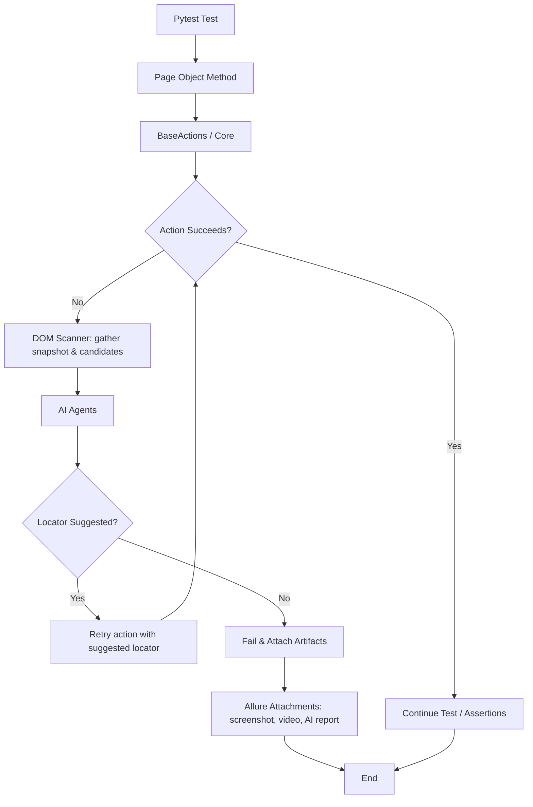

# AI Self-Healing E2E Framework

[](https://www.python.org/downloads/)
[](https://opensource.org/licenses/MIT)
[](https://playwright.dev/)

Elegant, resilient end-to-end testing using Playwright + lightweight local LLMs.
This framework demonstrates an extensible pattern for self-healing UI tests:
when a locator fails, the framework collects context, asks an AI agent for
help, and retries with a suggested locator — plus it archives rich artifacts
for fast debugging.

---

**Contents**
- Summary
- Features
- Quick Start
- Configuration
- Running Tests
- Debugging & Reports
- Architecture (flowchart)
- AI Agents
- Development & Contributing
- License

---

## Summary

This repository provides:

- Page Object Model examples in `page_objects/`
- Resilient low-level actions and DOM analysis in `framework_core/`
- AI agents that suggest locators and analyze failures in `agents/`
- Pytest integration (fixtures, hooks) and Allure reporting

Use this as a starting point for building robust E2E suites that recover
from small DOM changes and provide actionable diagnostics when tests fail.

## Features

- **Self-Healing Locators**: Automatic retry with AI-suggested alternatives on failure.
- **Local LLM Integration**: Uses Ollama for privacy-preserving, offline AI analysis.
- **Rich Artifacts**: Screenshots, videos, and structured AI reports attached to Allure.
- **Page Object Model**: Clean, maintainable test structure.
- **Extensible Architecture**: Easy to add new AI agents or analysis strategies.
- **Zero-Config Reporting**: Allure integration with automatic HTML generation.

## Quick Start (macOS / Linux)

1. Clone the repo:

   ```bash
   git clone https://github.com/vineethbandi/ai-self-healing-e2e-framework.git
   cd ai-self-healing-e2e-framework
   ```

2. Create and activate a Python virtual environment:

   ```bash
   python3 -m venv venv
   source venv/bin/activate
   pip install -r requirements.txt
   ```

3. Install Playwright browsers (required):

   ```bash
   playwright install
   ```

4. (Optional) Install Allure CLI for HTML reports (macOS example):

   ```bash
   brew install allure
   ```

5. Configure `configuration/config.yaml` for your environment (base_url, credentials,
   and local LLM endpoint). See the Configuration section below.

6. Run tests:

   ```bash
   pytest
   ```

## Configuration

Edit `configuration/config.yaml` and set values for the environment you will test
against. Key items to update:

- `env`: default environment (e.g., `qa`)
- `base_url`: application URL under test
- `username` / `password`: test credentials
- `ollama.url` and `ollama.model`: local LLM endpoint and model name

Keep secrets out of the repo. Prefer environment variables or a CI secret
manager for production credentials.

## Running Tests & Reports

- `pytest` runs tests and collects Allure results into `allure-results/` by
  default (see `pytest.ini`).
- After the session the repository has a hook that attempts to generate an
  Allure report at `allure-report/` (requires local Allure CLI).
- Artifacts collected per test run:
  - Screenshots: `reports/screenshots/`
  - Videos: `reports/videos/`
  - Allure JSON: `allure-results/`

## Debugging Failures

When a test fails the framework:

1. Captures a screenshot and (if enabled) a video recording.
2. Calls `FailureAnalysisAgent.analyze_test_failure()` with the exception
   and current page URL for a high-level AI-powered classification.
3. For assertion/validation failures the `GenericErrorAgent` inspects the
   scoped DOM and returns a structured JSON analysis (detected error,
   suggested locator, and reason).

These artifacts are attached to Allure reports to make triage fast.

## Architecture — Flowchart

Below is a Mermaid flowchart showing how the framework operates end-to-end.



> Tip: The flowchart is embedded as Mermaid markup. For a graphical image,
> use a Mermaid renderer or the included helper scripts if provided.

## AI Agents

The framework leverages two specialized AI agents powered by local LLMs:

- **FailureAnalysisAgent**: Classifies test failures (e.g., locator issues vs. assertions) and suggests alternative locators based on DOM context.
- **GenericErrorAgent**: Performs deep analysis of validation failures, returning structured JSON with error type, suggested fixes, and reasoning.

Agents communicate via HTTP with Ollama, ensuring no data leaves your machine.

## Development & Contributing

- Keep test data and secrets out of the repository.
- When you change dependencies, re-freeze `requirements.txt` from an
  activated virtualenv: `pip freeze > requirements.txt`.
- Add clear unit tests for pure-Python helpers in `framework_core/` and `agents/`.
- Follow PEP 8 for code style; use type hints where possible.

## License

This project is licensed under the MIT License - see the [LICENSE](LICENSE) file for details.

---

Built for developers who value reliability and innovation in E2E testing. Contributions welcome!
